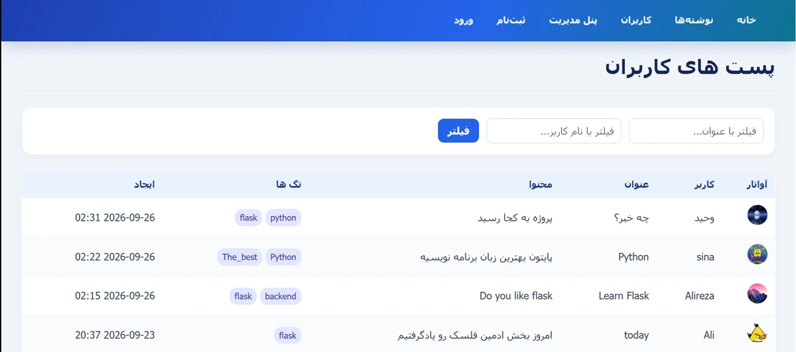
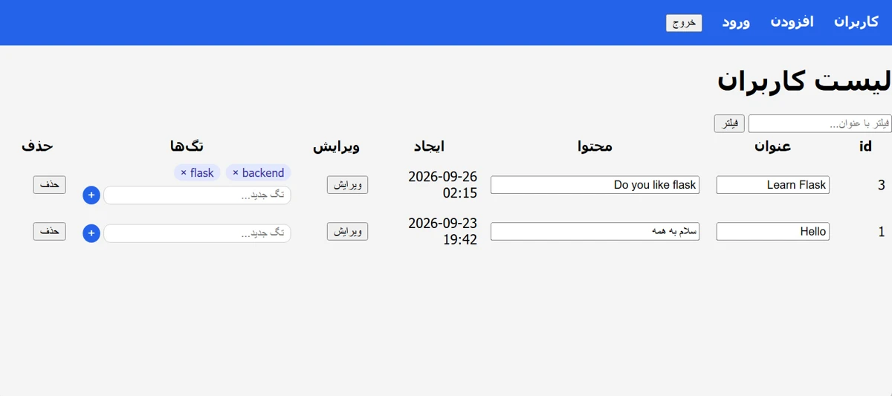
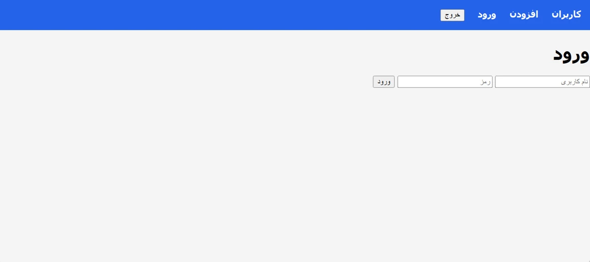
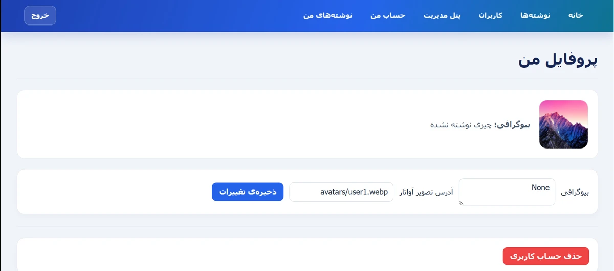
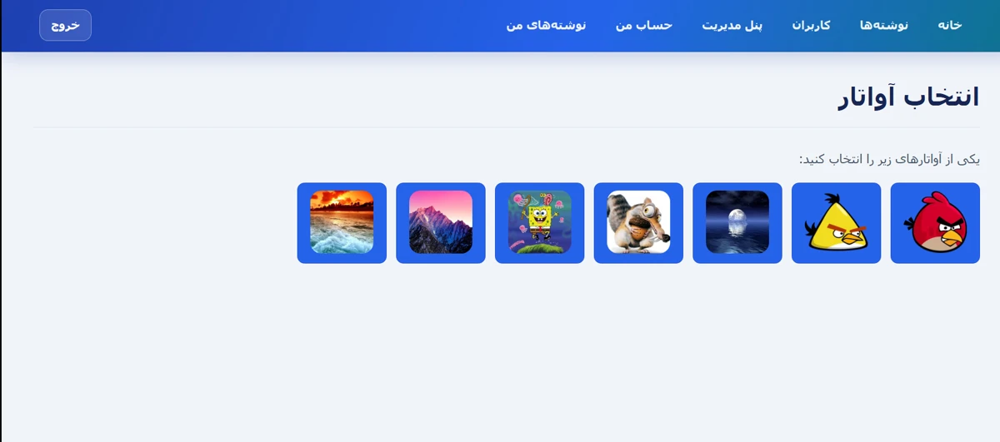
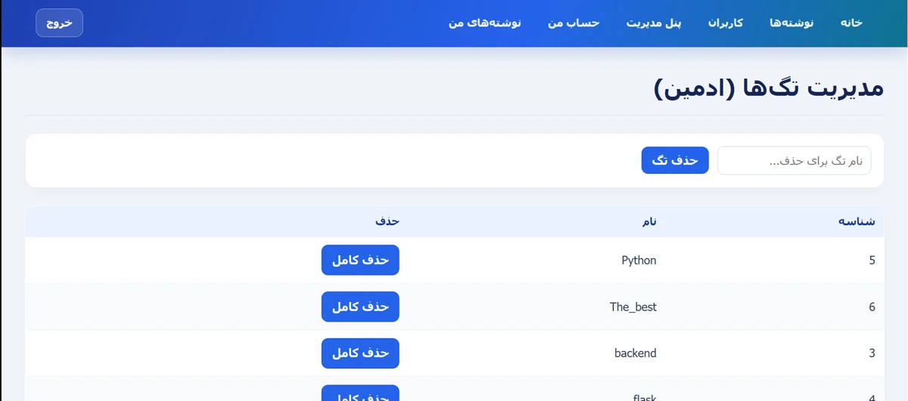

# flask-blog-platform

A small blog platform built with Flask, developed step by step to demonstrate solid backend fundamentals: authentication, relational data modeling, CRUD operations, and consistent code conventions across the codebase.

🔗 **Live Demo:** [flask-blog-platform-qzah.onrender.com](https://flask-blog-platform-qzah.onrender.com/)

## Prerequisites

- Python 3.14.5
- No external database server required — the project uses SQLite by default

## Installation & Setup

1. Clone the repository:

   ```bash
   git clone https://github.com/AlirezaAsady/flask-blog-platform.git
   cd flask-blog-platform
   ```

2. Create and activate a virtual environment:

   ```bash
   python -m venv venv
   source venv/bin/activate # on Windows: venv\Scripts\activate
   ```

3. Install dependencies:

   ```bash
   pip install -r requirements.txt
   ```

4. Set up environment variables:

   ```bash
   cp .env.example .env
   ```

   Then open `.env` and set `SECRET_KEY` to a random secret string.

5. Run the app:
   ```bash
   flask run
   ```

## Tech Stack

- Python / Flask
- SQLAlchemy (ORM)
- SQLite
- Jinja2 (templating)

## Features

This project is being built incrementally; items are checked off as they're implemented and committed.

- [x] User registration & authentication
- [x] Session-based login/logout
- [x] Create, edit, and delete blog posts
- [x] Tagging system for posts
- [x] User profiles with avatar selection
- [x] Admin panel for tag management
- [x] User promotion to admin

## Screenshots

### Post List



### Post Detail with Tags



### Login



### Profile



### Avatar Selection



### Admin Tag Management



## Project Conventions

This project follows a documented set of internal conventions for database function signatures, error handling, access control, and naming. See [CONVENTIONS.md](./CONVENTIONS.md) for details.

## Status

✅ MVP complete — actively used as a portfolio project; the commit history reflects real, incremental development.
